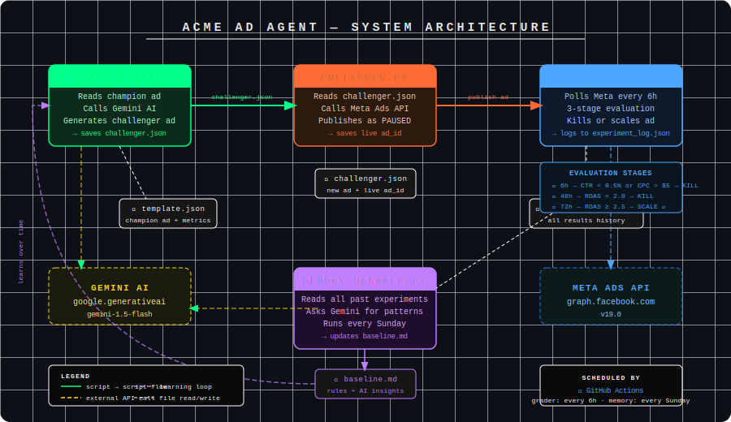

# Acme Ad Agent 🤖

An autonomous AI media buying agent that generates, publishes, grades, and learns from Meta (Facebook) ad experiments — on autopilot.

## Architecture



## How It Works

The agent runs a continuous Champion vs. Challenger testing loop:

1. **Orchestrator** — Reads the current champion ad and uses Gemini AI to generate one new challenger ad with a single variable changed (headline or copy).
2. **Publisher** — Pushes the challenger to your Meta Ads account in `PAUSED` status for safety review.
3. **Grader** — Checks performance at 3 decision points (6h, 48h, 72h) and automatically kills losers or flags winners for scaling.
4. **Memory Manager** — Runs a weekly analysis of all past experiments and writes discovered patterns back into `baseline.md` so the AI gets smarter over time.

## Grading Logic

| Checkpoint | Metric | Rule |
|---|---|---|
| 6 hours | CTR & CPC | Kill if CTR < 0.5% or CPC > $5.00 |
| 48 hours | ROAS | Kill if ROAS < 2.0 (fatigue threshold) |
| 72 hours | ROAS | Scale if ROAS ≥ 2.5, kill if below |

## Setup

### 1. Clone the repo
```bash
git clone https://github.com/yourusername/acme-ad-agent.git
cd acme-ad-agent
```

### 2. Install dependencies
```bash
pip install -r requirements.txt
```

### 3. Configure credentials
```bash
cp .env.example .env
```
Fill in `.env` with your real API keys (see [Required Credentials](#required-credentials) below).

### 4. Load your environment variables
```bash
export $(cat .env | xargs)
```
Or use a tool like [python-dotenv](https://pypi.org/project/python-dotenv/) to load them automatically.

### 5. Update `template.json`
Replace the placeholder `campaign_id`, `ad_set_id`, `ad_id`, and `image_hash` with your real Meta ad IDs and a valid uploaded image hash.

## Running the Agent

Run each script manually in order, or schedule them with a cron job:

```bash
# Step 1: Generate a new challenger ad
python orchestrator.py

# Step 2: Review challenger.json, then publish to Meta
python publisher.py

# Step 3: Grade performance (run this on a schedule — every 6 hours recommended)
python grader.py

# Step 4: Weekly memory update (run every Sunday)
python memory_manager.py
```

## Required Credentials

| Variable | Where to Get It |
|---|---|
| `GEMINI_API_KEY` | [Google AI Studio](https://aistudio.google.com/app/apikey) |
| `META_ACCESS_TOKEN` | [Meta Developer Portal](https://developers.facebook.com) |
| `META_AD_ACCOUNT_ID` | Meta Business Manager (format: `act_XXXXXXXXX`) |
| `META_PAGE_ID` | Your Facebook Business Page settings |

## File Structure

```
acme-ad-agent/
├── orchestrator.py      # AI ad generation
├── publisher.py         # Meta API publishing
├── grader.py            # Performance grading & auto-kill
├── memory_manager.py    # Weekly AI learning loop
├── baseline.md          # Brand rules + AI-discovered insights
├── program.md           # AI system prompt
├── template.json        # Current champion ad + metadata
├── .env.example         # Credential template
├── requirements.txt     # Python dependencies
└── .gitignore
```

> **Note:** `challenger.json` and `experiment_log.json` are generated at runtime and excluded from version control via `.gitignore`.

## Safety Notes

- All ads are published in `PAUSED` status. **You must manually activate them** in Meta Ads Manager after reviewing.
- The `Max Daily Budget Per Ad` is enforced at the Ad Set level in Meta — make sure your Ad Set budget matches the `$50.00` limit in `baseline.md`.

## Sample Output

After running several experiments, `experiment_log.json` looks like this (see `experiment_log_sample.json` for a full demo):

```json
[
  {
    "timestamp": "2026-02-28T22:41:10.221400",
    "ad_id": "12039485741",
    "metrics": { "spend": 38.20, "revenue": 57.30, "hours_active": 72.1 },
    "verdict": "LOSER - Final ROAS 1.50 failed the 2.5 target."
  },
  {
    "timestamp": "2026-03-05T14:05:44.119300",
    "ad_id": "12039485855",
    "metrics": { "spend": 49.10, "revenue": 196.40, "hours_active": 72.1 },
    "verdict": "WINNER - Final ROAS 4.00 beats the 2.5 target."
  },
  {
    "timestamp": "2026-03-06T18:33:02.774500",
    "ad_id": "12039485901",
    "metrics": { "spend": 31.60, "revenue": 44.24, "hours_active": 48.3 },
    "verdict": "LOSER - ROAS 1.40 fell below fatigue threshold of 2.0 at 48h."
  }
]
```

The full 8-experiment sample (`experiment_log_sample.json`) includes 4 winners, 4 losers, and all 3 kill stages demonstrated.

